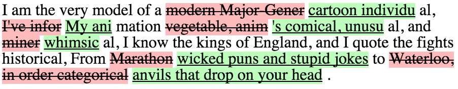

 diff-element
============

Element that shows diffs between two texts. Built with [Polymer](https://www.polymer-project.org) and powered by  [google_diff_match_patch](https://code.google.com/p/google-diff-match-patch/).

See the [component page](http://mikaelharsjo.github.io/diff-element) for more information.

## Usage
```html
<diff-element
  first="I am the very model of a modern Major-General, I've information vegetable, animal, and mineral, I know the kings of England, and I quote the fights historical, From Marathon to Waterloo, in order categorical."
  second="I am the very model of a cartoon individual, My animation's comical, unusual, and whimsical, I know the kings of England, and I quote the fights historical, From wicked puns and stupid jokes to anvils that drop on your head.">
</diff-element>
```



## Contributing

We use [Polyserve](https://github.com/PolymerLabs/polyserve) as your web server to allow canonical paths to
bower dependencies. Install with:

    npm install -g polyserve

And you can run it via:

    polyserve

Once running, you can view the component page at
`http://localhost:8080/components/diff-element/index.html`


## Testing Your Element

Simply navigate to:
`http://localhost:8080/components/diff-element/test/index.html`

### web-component-tester

The tests are also compatible with [web-component-tester](https://github.com/Polymer/web-component-tester). You can run them on multiple local browsers via:

```sh
npm install -g web-component-tester
wct
```
